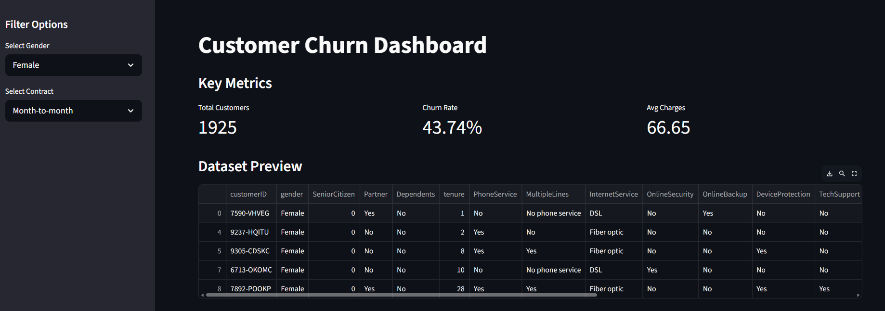
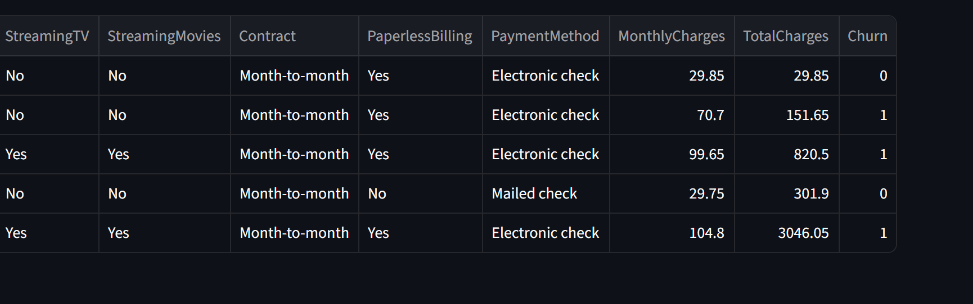
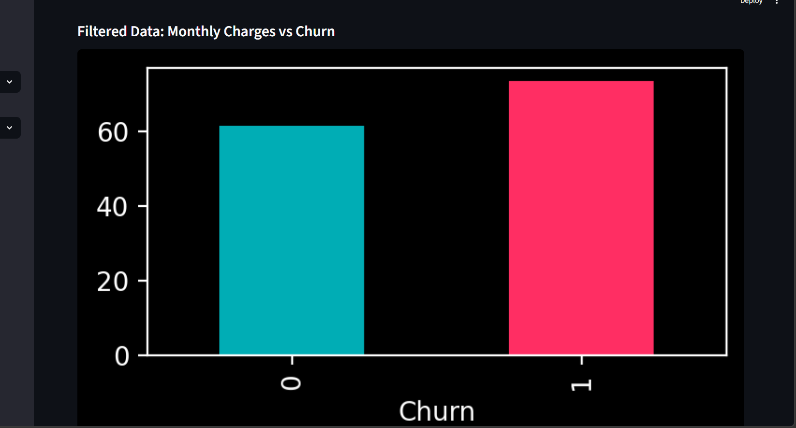
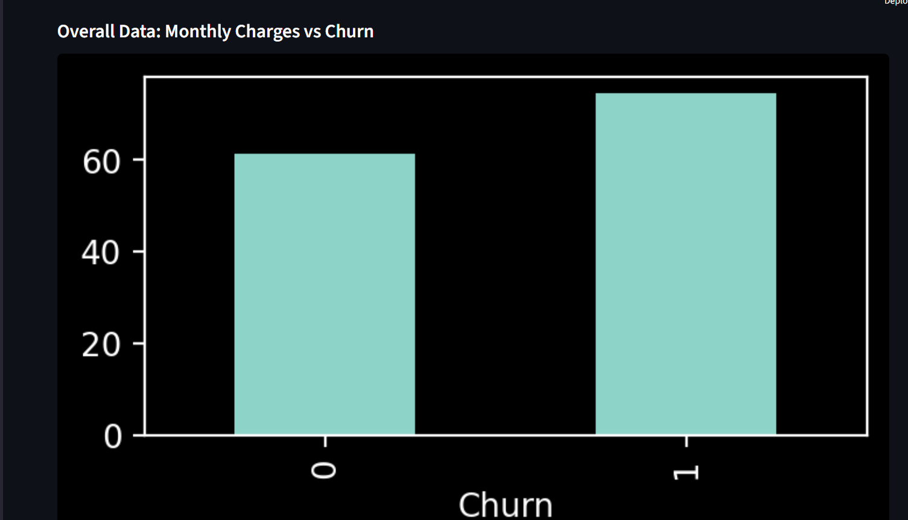
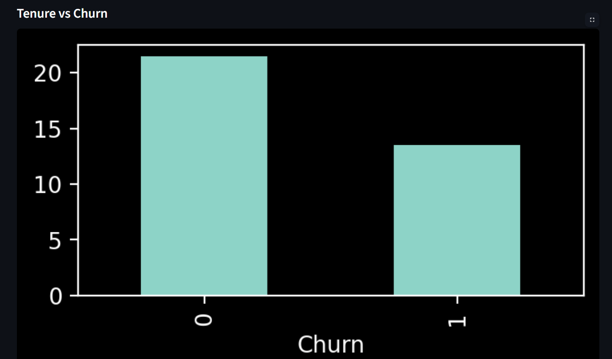
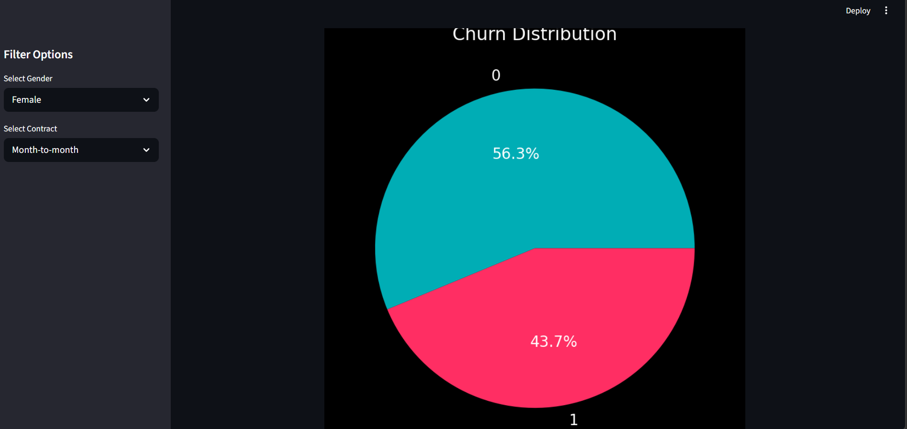
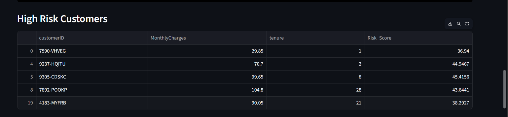
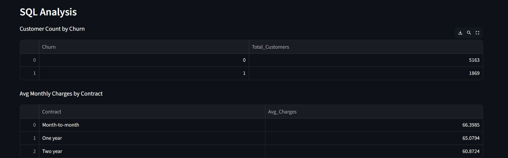
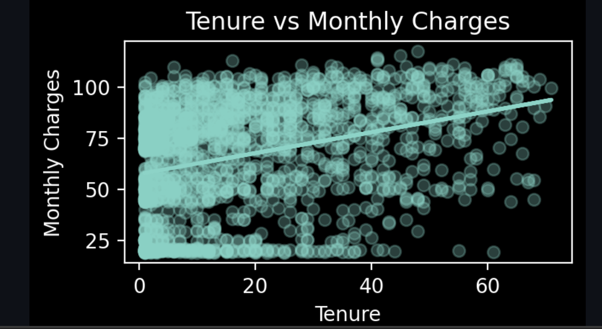

#  Customer Churn Dashboard

## Project Overview
This project is an interactive dashboard built using Streamlit to analyze customer churn data.  
It helps understand customer behavior and identify patterns related to churn.

---

## Features
-  Filter customers by gender and contract type
-  View key metrics like total customers, churn rate, and average charges
-  Visualize data using bar charts and pie charts
-  Perform SQL analysis using SQLite
-  Apply Linear Regression to analyze relationship between tenure and charges
-  Identify high-risk customers based on simple scoring

---

## Tools & Technologies
- Python  
- Pandas  
- Streamlit  
- Matplotlib  
- SQLite (SQL)  
- Scikit-learn  

---

## Dashboard Screenshots

###  Main Dashboard

###  Charts & Insights

###  High Risk Customers

###  SQL Analysis

###  Linear Regression Output

---

##  How to Run the Project

### 1️ Install required libraries

pip install pandas streamlit matplotlib scikit-learn

### 2️ Run the app

streamlit run app.py

---

##  Project Structure

churn-dashboard/
│
├── app.py
├── Telco_Customer_Churn.csv
├── screenshots/
│ ├── dashboard.png
│ ├── charts.png
│ ├── high_risk.png
│ ├── sql.png
│ └── regression.png
└── README.md

---

## Key Insights
- Customers with higher monthly charges tend to churn more
- Tenure has a weak relationship with monthly charges
- Contract type impacts churn behavior
- High-risk customers can be identified using simple scoring logic

---
##  Author
Swathi M K  

-  [LinkedIn](https://linkedin.com/in/swathi-m-k)  
-  [GitHub](https://github.com/swathimk2002)

